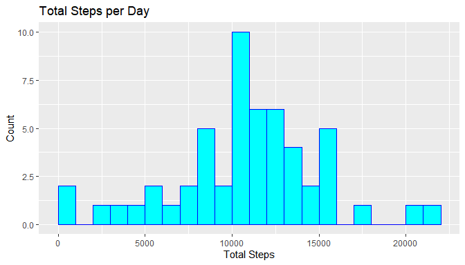
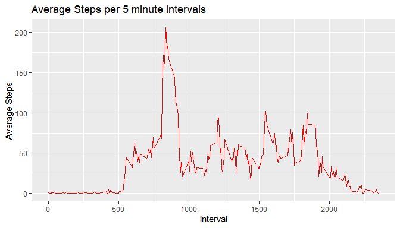
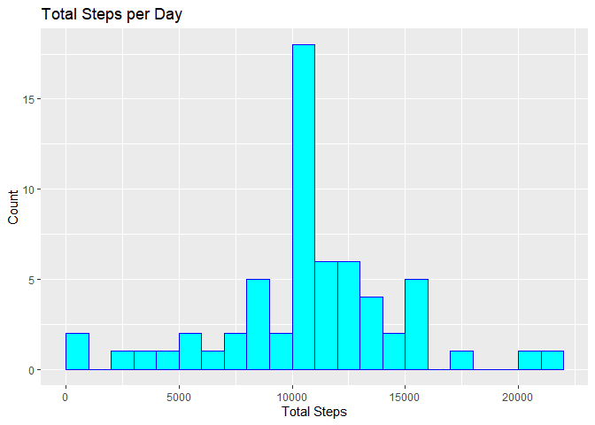
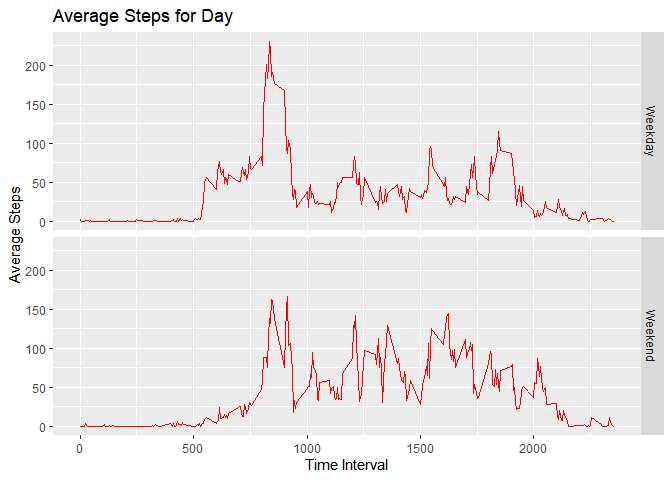

## Loading and preprocessing the data
First we load the data from the zip file included in this project into a Data Frame 

```r
library(dplyr)
library(ggplot2)
library(stringr)

datafile <- "activity.zip"
unzip(datafile)

activityData <- read.csv("activity.csv", colClasses = "character")
```
activityData data frame:

```r
str(activityData)
```

```
## 'data.frame':	17568 obs. of  3 variables:
##  $ steps   : chr  NA NA NA NA ...
##  $ date    : chr  "2012-10-01" "2012-10-01" "2012-10-01" "2012-10-01" ...
##  $ interval: chr  "0" "5" "10" "15" ...
```

```r
head(activityData)
```

```
##   steps       date interval
## 1  <NA> 2012-10-01        0
## 2  <NA> 2012-10-01        5
## 3  <NA> 2012-10-01       10
## 4  <NA> 2012-10-01       15
## 5  <NA> 2012-10-01       20
## 6  <NA> 2012-10-01       25
```
The variables need to be converted to be usable. Steps and intervals will be converted to numeric types, 
and date will be converted to a POSIXct date type.

```r
activityData <- transform(activityData, date =  as.POSIXct(paste(as.Date(activityData$date, format = "%Y-%m-%d"))))
activityData <- transform(activityData, steps = as.numeric(steps))
activityData <- transform(activityData, interval = as.numeric(interval))
```
Converted data:

```r
str(activityData)
```

```
## 'data.frame':	17568 obs. of  3 variables:
##  $ steps   : num  NA NA NA NA NA NA NA NA NA NA ...
##  $ date    : POSIXct, format: "2012-10-01" "2012-10-01" ...
##  $ interval: num  0 5 10 15 20 25 30 35 40 45 ...
```

```r
head(activityData)
```

```
##   steps       date interval
## 1    NA 2012-10-01        0
## 2    NA 2012-10-01        5
## 3    NA 2012-10-01       10
## 4    NA 2012-10-01       15
## 5    NA 2012-10-01       20
## 6    NA 2012-10-01       25
```

## What is mean total number of steps taken per day?
First we calculate the total number of steps taken per day:

```r
sumActivityData <- activityData %>% 
  group_by(date) %>%
  summarise(totalSteps = sum(steps))

head(sumActivityData)
```

```
## # A tibble: 6 x 2
##   date                totalSteps
##   <dttm>                   <dbl>
## 1 2012-10-01 00:00:00         NA
## 2 2012-10-02 00:00:00        126
## 3 2012-10-03 00:00:00      11352
## 4 2012-10-04 00:00:00      12116
## 5 2012-10-05 00:00:00      13294
## 6 2012-10-06 00:00:00      15420
```
Here is the histogram for the total number of steps per day:

```r
g <- ggplot(sumActivityData, aes(totalSteps)) 
g + geom_histogram(boundary = 0, binwidth = 1000, col="blue", fill="cyan") + ggtitle("Total Steps per Day") + xlab("Total Steps") + ylab("Count")
```

```
## Warning: Removed 8 rows containing non-finite values (stat_bin).
```

<!-- -->

Mean total steps per day

```r
MeanTotalSteps <- mean(sumActivityData$totalSteps, na.rm = TRUE)
MeanTotalSteps
```

```
## [1] 10766.19
```
Median total steps

```r
MedianTotalSteps <- median(sumActivityData$totalSteps, na.rm = TRUE)
MedianTotalSteps
```

```
## [1] 10765
```

## What is the average daily activity pattern?

First we create a data set for the average number of steps across all days group by 5-minute intervals

```r
MeanActivityData <- activityData %>% 
  group_by(interval) %>%
  summarise(avgSteps = mean(steps, na.rm=TRUE))

head(MeanActivityData)
```

```
## # A tibble: 6 x 2
##   interval avgSteps
##      <dbl>    <dbl>
## 1        0   1.72  
## 2        5   0.340 
## 3       10   0.132 
## 4       15   0.151 
## 5       20   0.0755
## 6       25   2.09
```

Now we can plot the average number of steps per interval, across all days

```r
gm <- ggplot(MeanActivityData, aes(x=interval, y=avgSteps))
gm + geom_line(col="red")+xlab("Interval")+ylab("Average Steps")+ggtitle("Average Steps per 5 minute intervals")
```

<!-- -->

Which 5-minute interval, on average across all the days in the data set, contains the maximum number of steps?

The plot suggests that the maximum number of steps happens around 8 in the morning.

```r
MaxAvgInt <- MeanActivityData[which.max(MeanActivityData$avgSteps),]$interval
MaxAvgInt
```

```
## [1] 835
```
Formatting interval as time

```r
timeIntHighest <- paste(as.character(MaxAvgInt%/%100), ":",str_pad(as.character(MaxAvgInt%%100),2,pad="0"), sep = "")
```


The maximum number of steps happens at interval **835** or **8:35** in the morning. 
This is consistent with the histogram.

## Inputing missing values

First we Calculate and report the total number of missing values in the dataset


```r
NADF <- activityData[rowSums(is.na(activityData)) > 0,]
obsNA <- nrow(NADF)
obsNA
```

```
## [1] 2304
```
There are **2304** observations with missing data for steps.

To fill in the missing data we will use the rounded average for the time interval.

```r
##Temp data set to add mean data
TempActivityData <- activityData
meanSteps <- round(MeanActivityData[ match(TempActivityData$interval, MeanActivityData$interval ) , 'avgSteps'])
TempActivityData$avgStepsForInt <- meanSteps$avgSteps
```
Temp data set contains variable the average steps for the corresponding time interval

```r
head(TempActivityData)
```

```
##   steps       date interval avgStepsForInt
## 1    NA 2012-10-01        0              2
## 2    NA 2012-10-01        5              0
## 3    NA 2012-10-01       10              0
## 4    NA 2012-10-01       15              0
## 5    NA 2012-10-01       20              0
## 6    NA 2012-10-01       25              2
```
Then we add a column called **FilledSteps** that contains the average value for NA values, and the actual value for the available data.

```r
TempActivityData$FilledSteps <- ifelse(is.na(TempActivityData$steps), TempActivityData$avgStepsForInt, TempActivityData$steps)
head(TempActivityData)
```

```
##   steps       date interval avgStepsForInt FilledSteps
## 1    NA 2012-10-01        0              2           2
## 2    NA 2012-10-01        5              0           0
## 3    NA 2012-10-01       10              0           0
## 4    NA 2012-10-01       15              0           0
## 5    NA 2012-10-01       20              0           0
## 6    NA 2012-10-01       25              2           2
```
No we can create a new data set that is equal to the original data set but with the missing data filled in.

```r
FullActivityData <- data.frame(steps=TempActivityData$FilledSteps, date = TempActivityData$date, interval = TempActivityData$interval)
head(FullActivityData)
```

```
##   steps       date interval
## 1     2 2012-10-01        0
## 2     0 2012-10-01        5
## 3     0 2012-10-01       10
## 4     0 2012-10-01       15
## 5     0 2012-10-01       20
## 6     2 2012-10-01       25
```
Then we make a histogram of the total number of steps taken each day.


```r
FullsumActivityData <- FullActivityData %>% 
  group_by(date) %>%
  summarise(totalSteps = sum(steps))

Fg <- ggplot(FullsumActivityData, aes(totalSteps)) 
Fg + geom_histogram(boundary = 0, binwidth = 1000, col="blue", fill="cyan") + ggtitle("Total Steps per Day") + xlab("Total Steps") + ylab("Count")
```

<!-- -->
We calculate the mean and median total number of steps taken per day. 


```r
FullmeanTotalSteps <- mean(FullsumActivityData$totalSteps, na.rm = TRUE)
FullmedianTotalSteps <- median(FullsumActivityData$totalSteps, na.rm = TRUE)
FullmeanTotalSteps
```

```
## [1] 10765.64
```

```r
FullmedianTotalSteps
```

```
## [1] 10762
```
We generate a table to compare the mean and median values.

```r
Mean <- c(With_NAs = MeanTotalSteps, Without_NAs = FullmeanTotalSteps)
Median <- c(With_NAs = MedianTotalSteps, Without_NAs = FullmedianTotalSteps)
compareAvg <- data.frame(Mean, Median)
```

Do these values differ from the estimates from the first part of the assignment? 
What is the impact of imputing missing data on the estimates of the total daily number of steps?

```r
##knitr::kable(compareAvg, "simple")
```


                   Mean   Median
------------  ---------  -------
With_NAs       10766.19    10765
Without_NAs    10765.64    10762


The new mean and median are slightly lower than the original values, but not significantly. 
The Histograms present an activity pattern similar to the original data with missing values.


## Are there differences in activity patterns between weekdays and weekends?

We create a new factor variable in the dataset with two levels – “weekday” and “weekend” indicating whether a given date is a weekday or weekend day.


```r
FullActivityData$Day <- ifelse(strftime(FullActivityData$date, "%A") == "Saturday"| strftime(FullActivityData$date, "%A") == "Sunday","Weekend","Weekday")
head(FullActivityData)
```

```
##   steps       date interval     Day
## 1     2 2012-10-01        0 Weekday
## 2     0 2012-10-01        5 Weekday
## 3     0 2012-10-01       10 Weekday
## 4     0 2012-10-01       15 Weekday
## 5     0 2012-10-01       20 Weekday
## 6     2 2012-10-01       25 Weekday
```

We then make a panel plot containing a time series plot of the 5-minute interval (x-axis) and the average number of steps taken, averaged across all weekday days or weekend days (y-axis).


```r
FullMeanDayActivityData <- aggregate(steps ~ interval + Day, data=FullActivityData, FUN = mean)


gDf <- ggplot(FullMeanDayActivityData, aes(x=interval, y=steps))
gDf + geom_line(col="red")+xlab("Time Interval")+ylab("Average Steps")+ggtitle("Average Steps for Day")+facet_grid(Day ~ .)
```

<!-- -->

During the weekdays the highest step activity occurs in the morning, between intervals 500 and 1000 (5 -  10 in the morning), 
with less activity during the day.
During the weekends peak steps are lower, with the highest activity occurring 750 and 1000, but there is higher activity 
throughout the day, especially between 1000 and 1750.
